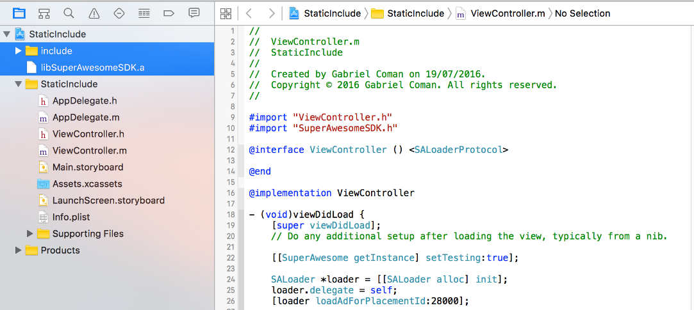
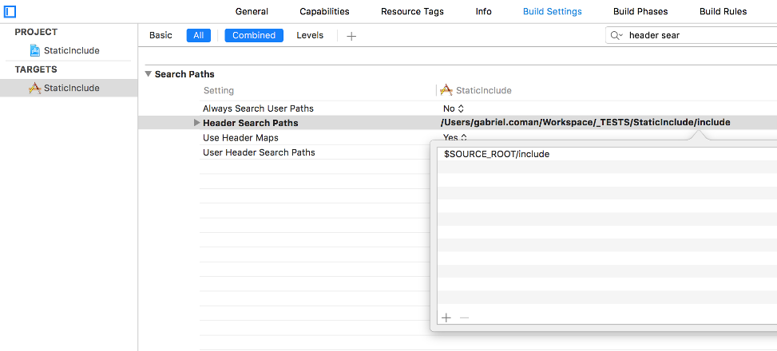
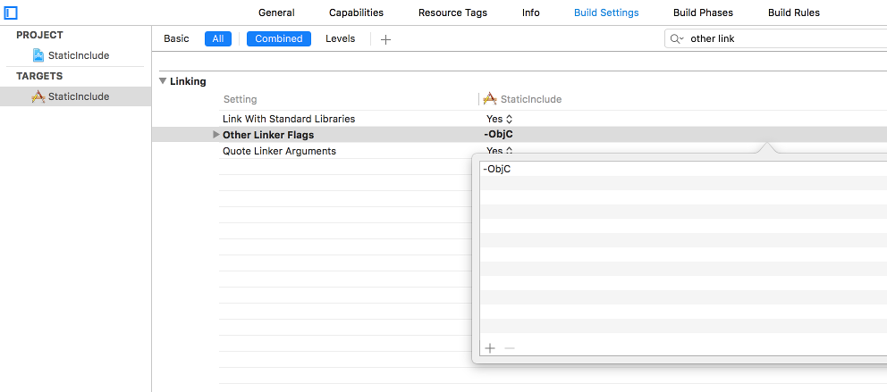

Add the SDK as a static library
===============================

You can download the latest `SuperAwesomeSDK-<sdk_version>.iOS.lib.zip <https://github.com/SuperAwesomeLTD/sa-sdk-build-repo/blob/master/package/<sdk_version>/SuperAwesomeSDK-<sdk_version>.iOS.lib.zip?raw=true>`_ file - which contains the **libSuperAwesomeSDK.a** and
associated **include** folder to add to your project as a static library.

Once you've downloaded the zip archive, open it and add the library and the folder in your project.

Then add the necessary paths to **Header Search Paths**

And finally add the *-ObjC* flag to **Other Linker Flags**

You can import the same SDK header file like so:

.. code-block:: c++

    #import "SuperAwesomeSDK.h"
