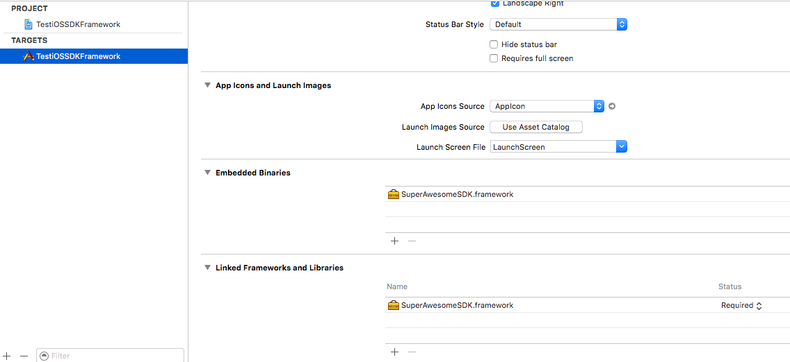

Add the SDK as a framework
==========================

You can also install the project as a standalone **.framework** library.

First you'll need to download the latest `SuperAwesomeSDK-<sdk_version>.iOS.framework.zip <https://github.com/SuperAwesomeLTD/sa-sdk-build-repo/blob/master/package/ios/<sdk_version>/SuperAwesomeSDK-<sdk_version>.iOS.framework.zip?raw=true>`_.

You'll then need to add the .framework file in the **Embedded Binaries** section of your project's target:

You can import the same SDK header file like so:

.. code-block:: c++

    #import <SuperAwesomeSDK/SuperAwesome.h>
