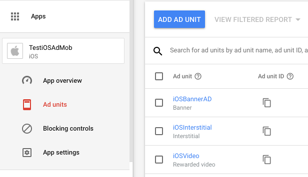
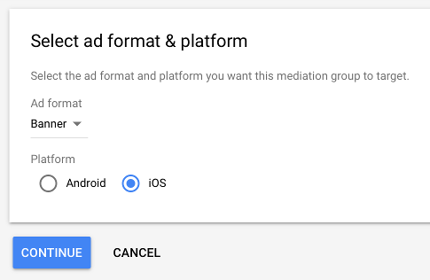
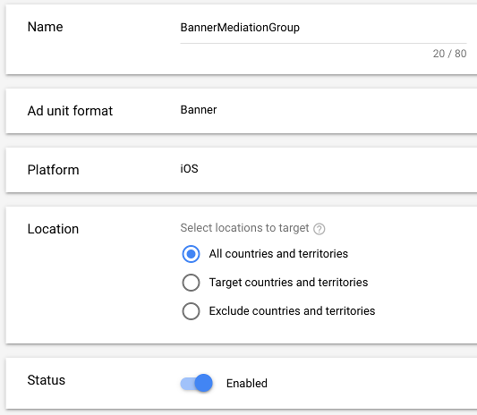
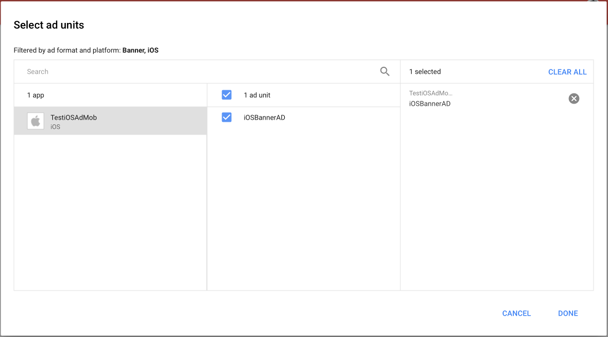
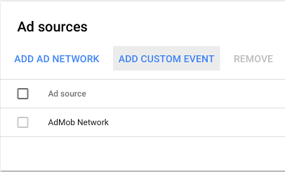
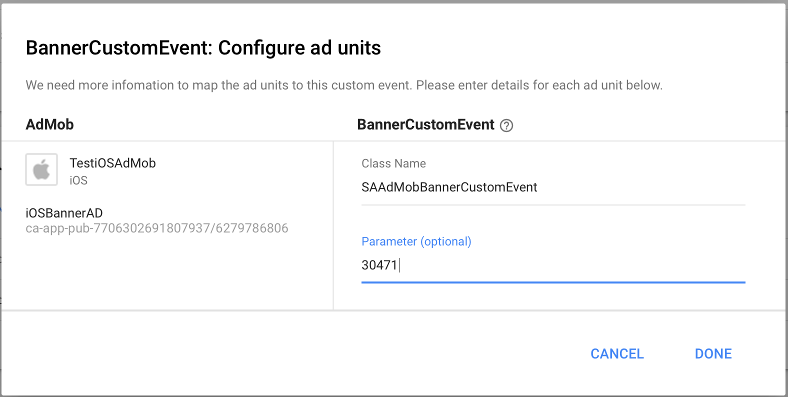

Integrate with AdMob
====================

If you already have AdMob ads serving in your app, but want to integrate SuperAwesome as well,
without having to directly use the AwesomeAds SDK, you can follow the steps below:

Add the AdMob plugin
--------------------

Change your **Podfile** to contain the following:

.. code-block:: shell

    target 'MyProject' do
        # add the SuperAwesome SDK
        pod 'SuperAwesome', '<sdk_version>'
        # or add just the base SDK
        # pod 'SuperAwesome/Base', '<sdk_version>'

        # add the MoPub plugin
        pod 'SuperAwesome/AdMob', '<sdk_version>'
    end

and execute

.. code-block:: shell

    pod update

The AdMob plugin will contain three main classes that conform to AdMob's guidelines regarding 3rd party ad network adapters:

* `SAAdMobBannerCustomEvent <https://github.com/SuperAwesomeLTD/sa-mobile-sdk-ios/blob/master/Pod/Plugin/AdMob/SAAdMobBannerCustomEvent.h>`_
* `SAAdMobInterstitialCustomEvent <https://github.com/SuperAwesomeLTD/sa-mobile-sdk-ios/blob/master/Pod/Plugin/AdMob/SAAdMobInterstitialCustomEvent.h>`_
* `SAAdMobVideoMediationAdapter <https://github.com/SuperAwesomeLTD/sa-mobile-sdk-ios/blob/master/Pod/Plugin/AdMob/SAAdMobVideoMediationAdapter.h>`_

Alternatively you can download a .zip file of the AdMob plugin, if you don't want to use CocoaPods: `SuperAwesomeSDK-<sdk_version>.iOS.AdMobPlugin.zip <https://github.com/SuperAwesomeLTD/sa-sdk-build-repo/blob/master/package/aa_ios/<sdk_version>/SuperAwesomeSDK-<sdk_version>.iOS.AdMobPlugin.zip?raw=true>`_.

Setup AdMob Mediation Groups
----------------------------

Login to the AdMob dashboard using your preferred account.

From here forward the tutorial assumes you have an iOS app with three ad units setup in AdMob; one banner, one interstitial ad and one rewarded video ad:

Then, in the **Mediation** menu, create a new Mediation Group:

Next, fill in the necessary details:

and add your app's banner **Ad Unit** as target:

Then, in the **Ad Sources** panel, add a new **Custom Event**:

and, as well, customise it:

.. image:: img/IMG_08_AdMob_6.png

and finally set the AwesomeAds custom event class name as Class Name **SAAdMobBannerCustomEvent** and the parameter as your **Placement ID**:

Finally, save your changes. This will register **BannerCustomEvent** as a custom event running on your ad units from now on.
You'll have to repeat the same process for interstitial and rewarded video ads.

Implement AdMob ads in your iOS app
-----------------------------------

Once the previous steps are done, you can add AdMob banners, interstitials and rewarded video ads just as you normally would:

.. code-block:: objective-c

    // 1.1 create a banner request
    GADRequest *bannerReq = [GADRequest request];

    // 1.2. add banner view
    GADBannerView *banner = [[GADBannerView alloc] initWithAdSize: kGADAdSizeBanner];
    banner.adUnitID = @"__YOUR_ADMOB_UNIT_ID__";
    banner.rootViewController = self;
    [self.view addSubview: banner];
    [banner loadRequest: bannerReq];

    // 2.1. create an interstitial request
    GADRequest *interstitialReq = [GADRequest request];

    // 2.2. add an interstitial
    GADInterstitial *interstitial = [[GADInterstitial alloc]
            initWithAdUnitID: @"__YOUR_ADMOB_UNIT_ID__"];
    [self.interstitial loadRequest: interstitialReq];

    // 3.1. create a rewarded video request
    GADRequest *videoReq = [GADRequest request];

    // 3.2. add rewarded video
    [[GADRewardBasedVideoAd sharedInstance] loadRequest: videoReq
            withAdUnitID: @"__YOUR_ADMOB_UNIT_ID__"];

Since the previously created custom events will run on these ads, and AwesomeAds is integrated alongside the AdMob plugin, you
should start seeing ads playing.

Customize the experience
------------------------

Additionally, you can customize the experience of each ad unit.

1) For banners:

.. code-block:: objective-c

    // First, create an options object where you set the parameters that
    // normally affect an AwesomeAds banner ad
    SAAdMobCustomEventExtra *options = [[SAAdMobCustomEventExtra alloc] init];
    options.testEnabled = false;
    options.parentalGateEnabled = true;
    options.trasparentEnabled = true;

    // then create a standard GADCustomEventExtras object
    GADCustomEventExtras *extra = [GADCustomEventExtras new];

    // and assign to it the options object created above
    // note that the label you add the options object for has to be
    // the same as the name of the custom mediation event you created
    [extra setExtras: options forLabel: @"BannerCustomEvent"];

    // finally register the GADCustomEventExtras object with the request
    [bannerReq registerAdNetworkExtras: extra];

2) For interstitials:

.. code-block:: objective-c

    // First, create an options object where you set the parameters that
    // normally affect an AwesomeAds interstitial ad
    SAAdMobCustomEventExtra *options = [[SAAdMobCustomEventExtra alloc] init];
    options.testEnabled = false;
    options.parentalGateEnabled = true;
    options.orientation = PORTRAIT;

    // then create a standard GADCustomEventExtras object
    GADCustomEventExtras *extra = [GADCustomEventExtras new];

    // and assign to it the options object created above
    // note that the label you add the options object for has to be
    // the same as the name of the custom mediation event you created
    [extra setExtras: options forLabel:@"InterstitialCustomEvent"];

    // finally register the GADCustomEventExtras object with the request
    [interstitialReq registerAdNetworkExtras: extra];

3) For rewarded video:

.. code-block:: objective-c

    // First, create an options object where you set all the parameters that
    // normally affect an AwesomeAds video ad
    SAAdMobVideoExtra *options = [[SAAdMobVideoExtra alloc] init];
    options.testEnabled = false;
    options.closeAtEndEnabled = true;
    options.closeButtonEnabled = false;
    options.parentalGateEnabled = false;
    options.smallCLickEnabled = true;
    options.orientation = LANDSCAPE;

    // For video, just register the options object with the request directly
    [videoReq registerAdNetworkExtras: options];

These parameters will be passed by the AdMob SDK to the AwesomeAds Plugin so that ads will display the way you want them to.
