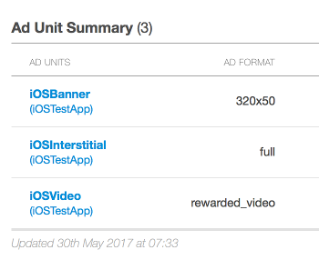
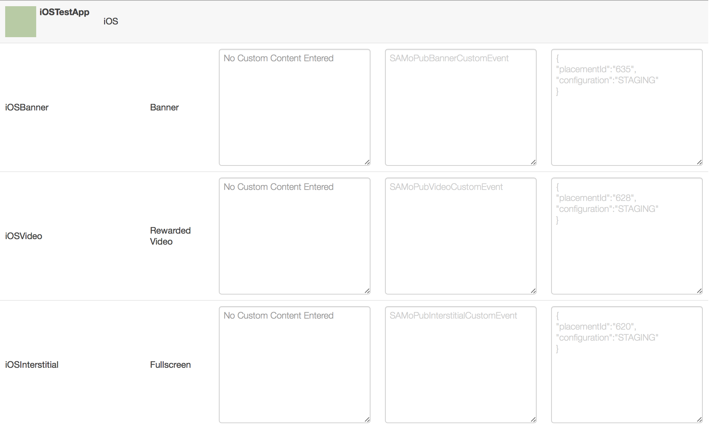

Integrate with MoPub
====================

If you already have MoPub ads serving in your app, but want to integrate AwesomeAds as well,
without having to directly use the iOS Publisher SDK, you can follow the steps below:

Add the MoPub plugin
--------------------

Change your **Podfile** to contain the following:

.. code-block:: shell

    target 'MyProject' do
        # add the SuperAwesome SDK
        pod 'SuperAwesome', '<sdk_version>'
        # or add just the base SDK
        # pod 'SuperAwesome/Base', '<sdk_version>'

        # add the MoPub plugin
        pod 'SuperAwesome/MoPub', '<sdk_version>'
    end

and execute

.. code-block:: shell

    pod update

Alternatively you can download a .zip file of the MoPub plugin, if you don't want to use CocoaPods: `SuperAwesomeSDK-<sdk_version>.iOS.MoPubPlugin.zip <https://github.com/SuperAwesomeLTD/sa-sdk-build-repo/blob/master/package/aa_ios/<sdk_version>/SuperAwesomeSDK-<sdk_version>.iOS.MoPubPlugin.zip?raw=true>`_.

Setup MoPub Custom Networks
---------------------------

Login to the MoPub dashboard using your preferred account.

From here forward the tutorial assumes you have an iOS app with three ad units setup in MoPub; one banner, one interstitial ad and one rewarded video ad:

From your MoPub admin interface you should create a **New Network**

.. image:: img/IMG_07_MoPub_1.png

From the next menu, select **Custom Native Network**

.. image:: img/IMG_07_MoPub_2.png

You'll be taken to a new page. Here select the title of the new network

.. image:: img/IMG_07_MoPub_3.png

And assign custom inventory details for Banner, Interstitial and Video ads:

Notice that the custom event classes required by MoPub are:

* for Banner Ads: **SAMoPubBannerCustomEvent**
* for Interstitial Ads: **SAMoPubInterstitialCustomEvent**
* for Rewarded Video Ads: **SAMoPubVideoCustomEvent**

Finally, you can tell MoPub what AwesomeAds ads to load and how to display them by filling out the
custom event class data field with a JSON similar to this:

.. code-block:: shell

    {
        "placementId": 30473,
        "isTestEnabled": true or false,
        "isParentalGateEnabled": true or false,
        "orientation": "ANY" or "PORTRAIT" or "LANDSCAPE",
        "shouldShowCloseButton": false or false,
        "shouldAutomaticallyCloseAtEnd": true or false,
        "shouldShowSmallClickButton": true or false
    }

Implement MoPub ads in your iOS app
-----------------------------------

Once the previous steps are done, you can add MoPub banners, interstitials and rewarded video ads just as you normally would:

.. code-block:: objective-c

    //
    // create & load banner
    MPAdView *banner = [[MPAdView alloc] initWithAdUnitId:@"_AD_UNIT_ID_"
            size:MOPUB_BANNER_SIZE];
    banner.frame = CGRectMake(0, 0, self.view.frame.size.width, 80);
    [self.view addSubview: banner];
    [banner loadAd];

    //
    // create & load interstitial
    MPInterstitialAdController *interstitial =
            [MPInterstitialAdController interstitialAdControllerForAdUnitId: @"_AD_UNIT_ID_"];
    [interstitial loadAd];

    //
    // load video ads
    [[MoPub sharedInstance]
            initializeRewardedVideoWithGlobalMediationSettings: nil
            delegate: self];
    [MPRewardedVideo
            loadRewardedVideoAdWithAdUnitID: @"_AD_UNIT_ID_"
            withMediationSettings: nil];

Since the previously created custom events will run on these ads, and AwesomeAds is integrated alongside the MoPub plugin, you
should start seeing ads playing.
